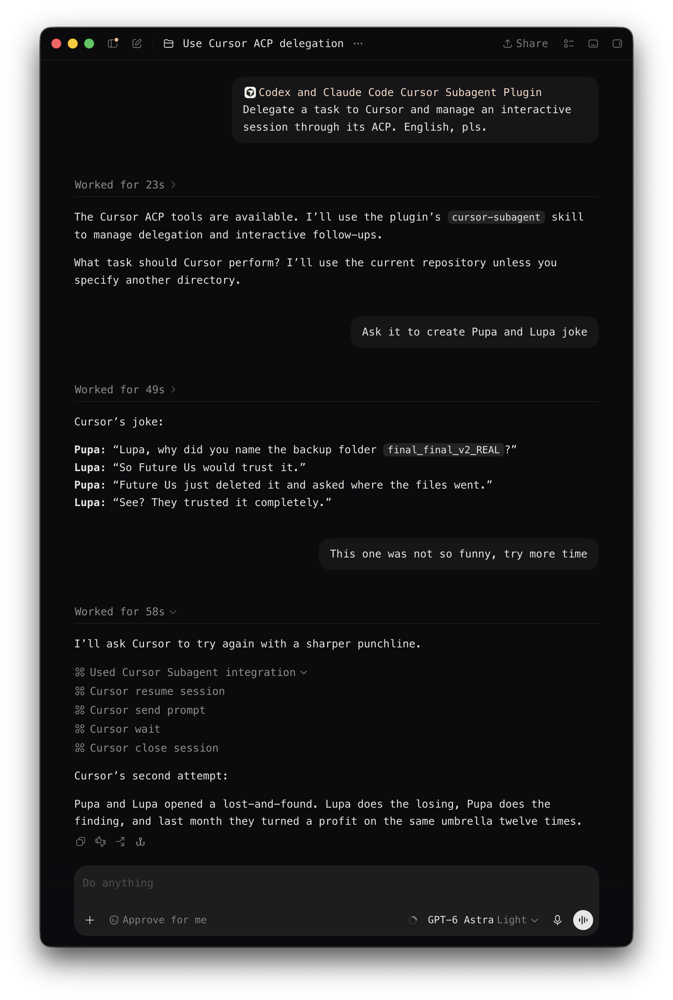

# Codex and Claude Code Cursor Subagent Plugin

Use Cursor Agent as an interactive subagent from Codex or Claude Code. Delegate
code investigation, reviews, planning, and implementation without manually
moving prompts and results between applications.

The plugin launches your installed Cursor Agent through ACP and exposes its
interactive session through MCP. You can follow progress, answer questions,
review plans, and continue with follow-up tasks.

## Contents

- [Demo](#demo)
- [Requirements](#requirements)
- [Cursor Agent setup](#cursor-agent-setup)
- [Install in Codex](#install-in-codex)
- [Install in Claude Code](#install-in-claude-code)
- [Usage](#usage)
- [Permissions and scope](#permissions-and-scope)
- [Development](#development)

## Demo

Delegating a task to Cursor from Codex, then resuming the ACP session for a
follow-up request:



## Requirements

- runtime and portable installation: Node.js 18+;
- Cursor Agent (`cursor-agent`) installed and authenticated before using the plugin
  (see [Cursor Agent setup](#cursor-agent-setup) below);
- Codex with local plugin/MCP support, or Claude Code with plugin support.

## Cursor Agent setup

### Install the CLI

The plugin does not install Cursor Agent or sign you in. Install and authenticate
it under the same OS user and in the environment where Codex or Claude Code runs.
Follow the official [Cursor CLI installation guide](https://cursor.com/docs/cli/installation).
On macOS, Linux, or WSL:

```bash
curl https://cursor.com/install -fsS | bash
export PATH="$HOME/.local/bin:$PATH"
cursor-agent --version
```

Keep `~/.local/bin` on the host application's `PATH`, or set
`CURSOR_AGENT_COMMAND` to the absolute Agent executable path. The installer
provides the current CLI. The plugin has been tested with Cursor Agent
`2026.08.25-3e8eec8`. Newer versions are expected to work if they preserve the
required ACP interface, but have not yet been verified. The plugin checks ACP
compatibility at startup without requiring an exact Cursor version.

### Sign in with file-backed credentials

Sign in through the browser using the file-backed credential store:

```bash
AGENT_CLI_CREDENTIAL_STORE=file cursor-agent login
AGENT_CLI_CREDENTIAL_STORE=file cursor-agent status --format json
```

Complete the browser login and confirm that the status command reports you as
authenticated before starting a delegated task. Both plugin configurations set
`AGENT_CLI_CREDENTIAL_STORE=file`, so use that same setting for login and status.
On macOS this selects file storage instead of Keychain. If you previously signed
in using Keychain, run the file-backed login above as well.

The official [Cursor authentication guide](https://cursor.com/docs/cli/reference/authentication)
explains browser login and status checks. The file-store environment variable is
an option of the supported Cursor Agent version used by this plugin; it is not
documented on that page.

## Install in Codex

See the official [Codex plugin installation guide](https://learn.chatgpt.com/docs/plugins#plugin-browser-in-codex-cli).
For this repository, run these commands in your terminal with the Codex CLI
available on `PATH`:

```bash
codex plugin marketplace add arikon/agents-cursor-subagent-plugin --ref main
codex plugin add agents-cursor-subagent-plugin@agents-cursor-subagent-plugin
```

The first command registers a GitHub repository as a marketplace; the second
installs the plugin from its marketplace snapshot. Check the configured
marketplaces and installed plugins with:

```bash
codex plugin marketplace list --json
codex plugin list --json
```

Start a new Codex task after installing the plugin so Codex loads its skills
and MCP server. You can also open `/plugins` inside Codex CLI to inspect the
configured marketplace and installed plugin.

### Update the Codex plugin

Refresh the marketplace snapshot, then reinstall the cached plugin:

```bash
codex plugin marketplace upgrade agents-cursor-subagent-plugin
codex plugin remove agents-cursor-subagent-plugin@agents-cursor-subagent-plugin
codex plugin add agents-cursor-subagent-plugin@agents-cursor-subagent-plugin
```

Start a new Codex task only after the final `plugin add` succeeds.

### Breaking update: `cursor_wait`

This release removes `after_event_id` and `after_progress_revision` from
`cursor_wait`. Before updating, finish or close every delegated Cursor session
and stop the MCP process. Then run the update commands above and start a new
Codex task so that it loads the matching installed skill and tools. Replacing
plugin files while an old task is open does not update that task's MCP process.

To roll back, use the previous plugin revision, repeat the same close/restart
boundary, and open another new task. Do not combine an old skill with the new
runtime, or the new skill with the old runtime.

## Install in Claude Code

See the official [Claude Code plugin installation guide](https://code.claude.com/docs/en/discover-plugins)
and [CLI command reference](https://code.claude.com/docs/en/plugins-reference#cli-commands-reference).
The same GitHub repository is a Claude Code marketplace. It requires `node` and
an authenticated Cursor Agent available as `cursor-agent` in `PATH`; set
`CURSOR_AGENT_COMMAND` in the Claude Code environment only when the command has
a non-standard location.

```bash
claude plugin marketplace add arikon/agents-cursor-subagent-plugin
claude plugin install agents-cursor-subagent-plugin@agents-cursor-subagent-plugin --scope user
claude plugin list --json
```

Run these commands in your terminal. `--scope user` makes the plugin available
to you across projects; use `--scope project` to share the plugin declaration
with a repository instead. The Claude Code plugin is named `agents-cursor-subagent-plugin`,
and its marketplace is named `agents-cursor-subagent-plugin`.

Restart Claude Code after installation to load the plugin. In an existing
session, `/reload-plugins` also applies plugin changes; use `/plugin` to inspect
installed plugins.

### Update the Claude Code plugin

Refresh the marketplace and installed plugin after a new Git revision, then
restart Claude Code to load the updated MCP server:

```bash
claude plugin marketplace update agents-cursor-subagent-plugin
claude plugin update agents-cursor-subagent-plugin@agents-cursor-subagent-plugin
```

Installing the plugin only makes the existing `cursor_*` MCP tools and
`cursor-subagent` skill available. It does not approve Cursor actions: questions,
plans, and out-of-scope, destructive, external, or credential-related permission
requests still require the same explicit authority as in Codex.

## Usage

Ask the host assistant to delegate a bounded task to Cursor, for example:

> Ask Cursor to review `src/parser.ts` for correctness without changing files.

The bundled [cursor-subagent skill](skills/cursor-subagent/SKILL.md) guides the
assistant through delegation, permissions, follow-ups, and cleanup.

### Modes

| Mode | Use it for |
| --- | --- |
| `ask` | Read-only investigation, questions, diagnosis, and code review. |
| `plan` | Preparing a plan for approval. |
| `agent` | Implementation within the changes you authorized. |

### MCP tools

| Task | Tools |
| --- | --- |
| Delegate and follow progress | `cursor_delegate`, `cursor_wait` |
| Respond to pending requests | `cursor_answer_question`, `cursor_answer_plan`, `cursor_answer_permission` |
| Continue work between turns | `cursor_send_prompt`, `cursor_set_mode` |
| Read longer results | `cursor_read_result` |
| Resume or close a session | `cursor_resume_session`, `cursor_close_session` |
| Advanced diagnosis and recovery | `cursor_start_session`, `cursor_session_status`, `cursor_cancel` |

`cursor_wait` observes one addressed turn with `session_id`, `turn_id`, and an
optional `timeout_ms`. It returns the current pending request immediately, a
repeatable terminal result while retained, or a timeout snapshot with a bounded
progress excerpt. It does not require event or progress cursors.

### Follow-ups and resume

Continue a completed turn with `cursor_send_prompt` while its session is live.
A follow-up supplied during an active turn waits for that turn to finish;
the plugin cannot steer a running turn. Any outcome other than a completed turn
requires a new user decision before continuing.

Use `cursor_resume_session` to attempt to reopen a retained Cursor conversation
after its local session has closed or expired.

A successful resume does not prove that earlier context was restored. Include
the context and constraints needed for the next task. For a review, supply the
baseline or snapshot together with the new changes; if that evidence is missing,
report the review as unverifiable.

### Reading complete results

Completed turns include an 8 KB result preview. The runtime retains the full
result up to 1 MiB; larger results fail with `terminal_result_limit`.

When `result.truncated:true`, use `cursor_read_result` from offset zero, following
each `next_offset` until `eof`. Read the complete result before reporting it,
sending a follow-up, or closing the session.

### Workspace and session settings

Prefer the `cwd` of a separate verified worktree for tasks that may change files
or run concurrently. A canonical checkout is allowed when the user authorized
the changes and accepts the coordination risk.

For read-only work, select `ask` and restrict reads and searches to the
authorized scope. Select `agent` before making authorized changes. Switch modes
with `cursor_set_mode` only between turns.

To change `model`, `effort`, `fast`, or `plugin_dirs`, close the idle session and
immediately resume it with the retained Cursor conversation ID and new settings.
These launch settings cannot change in place.

Use a nonempty base-model name without `[` or `]`. The optional `effort` value
must be a nonempty token matching `[A-Za-z0-9._-]+`.

Close the session when the delegated workflow finishes, is abandoned, or fails
irrecoverably.

## Permissions and scope

The local transport is Codex or Claude Code → MCP plugin → Cursor ACP
(stdio JSON-RPC).

By default the plugin launches Cursor with sandboxing enabled and Smart Auto
(`--auto-review`), so Cursor may automatically run tool calls that it classifies
as safe. Questions, plans, and approval requests remain pending until answered.

The Git-marketplace configuration suppresses Codex-side MCP prompts. The
portable release canary uses the adapter's default elicitation path. These
transport settings do not expand the authority granted by the user.

In `agent` mode, Cursor can create or replace regular UTF-8 files anywhere inside
the selected `cwd`. The plugin's scope checks are not an OS sandbox or an exact
per-action policy engine.

For write-capable tasks and reviews narrower than the checkout, the host
assistant includes `AUTHORIZED_ACTIONS` and `NO_SCOPE_EXPANSION` in the delegated
prompt. These clauses communicate the task boundary; they do not add runtime
enforcement. The bundled skill provides the exact prompt format.

The plugin uses no file-based IPC and exposes only its documented MCP controls.
Version-specific adapters and golden fixtures define the underlying CLI and
protocol details.

## Development

See the [development guide](docs/development.md) for verification commands,
portable installation, behavior acceptance, and version-specific adapter migration.
